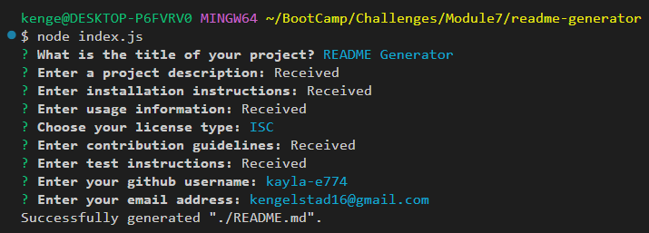
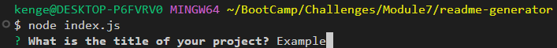
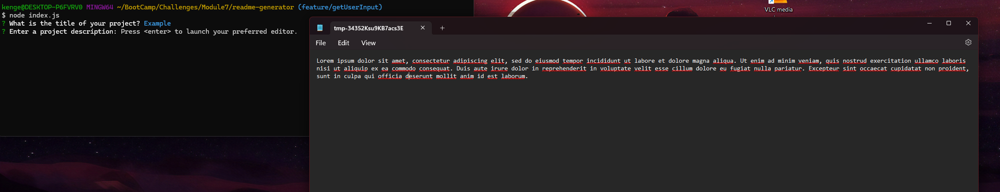
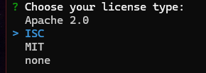
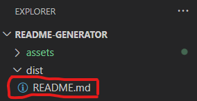

# README Generator
[](https://opensource.org/licenses/ISC)

## Description:
Command line application that quickly and easily generates a professional, high-quality README file.

## Table of Contents:
- [Technologies](#technologies)
- [Installation](#installation)
- [Usage](#usage)
- [License](#license)
- [Questions](#questions)

## Technologies:
- JavaScript ES2023
- Node.js
- [Inquirer.js](https://www.npmjs.com/package/inquirer)

## Installation:
- Download or clone this repo.
- From its root directory, install the necessary packages with the following command:
```
$ npm i
```

## Usage:
- Watch this demo:

https://github.com/user-attachments/assets/0f1a562b-53f4-4084-80fa-0eb96ac61e41


- From this repo's root directory, run the following command:
```
$ node index.js
```
- This launches a series of prompts. The answers to these prompts will be used to generate the README.md file.  

- For the title, github username, and email address, a simple input prompt allows you to enter input directly to the terminal. After giving the full answer, hit enter to submit the entry.  

- For the project description, installation instructions, usage information, contribution guidlines, and test instructions, an external text editor will be launched upon hitting enter. Navigate to to the text editor, input any desired information, save the input, and then close the document in the text editor to submit the entry.  

- To input the license type, use the arrow keys to select from the list of options displayed in the terminal, then hit enter to submit the entry.  

- Each time the program successfully runs, it will output a README.md file to the '/dist' folder in this repo. Note: it will overwrite past README.md files in that location, so be sure to save any wanted results elsewhere before re-running the program.  


## License:
This application is covered under the [ISC](https://opensource.org/licenses/ISC) license.

## Questions:
Contact me via github: [kayla-e774](https://github.com/kayla-e774)  
Or email me at: <kengelstad16@gmail.com>
